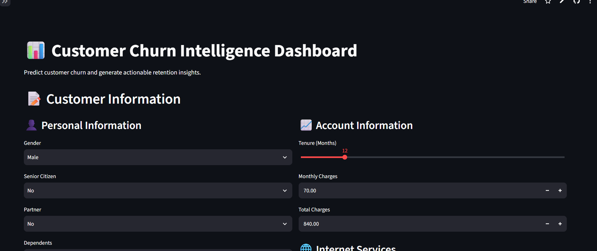
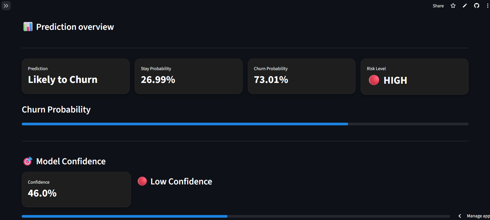
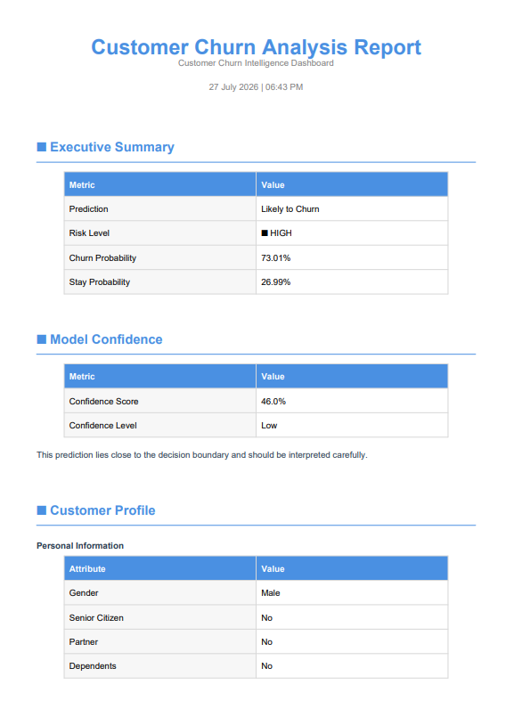

# 📊 Customer Churn Intelligence Dashboard


---

## 🌐 Live Demo

🚀 **Streamlit App**

👉 https://customer-churn-analysis2026.streamlit.app/

📂 **GitHub Repository**

👉 https://github.com/yashml-dev/Customer-churn-analysis

---

# 📖 Project Overview

Customer churn is one of the biggest challenges faced by subscription-based businesses such as telecom companies.

This project uses **Machine Learning** to predict whether a customer is likely to churn based on their demographic information, service usage, contract details and billing history.

The application provides not only a prediction but also actionable business insights, customer risk analysis and a downloadable PDF report that can support retention strategies.

---

# 🎯 Problem Statement

Acquiring a new customer costs significantly more than retaining an existing one.

The goal of this project is to help businesses identify customers who are likely to leave and recommend proactive retention strategies before churn occurs.

---

# ✨ Features

✅ Customer Churn Prediction

✅ Churn Probability Estimation

✅ Customer Risk Level Classification

✅ Interactive Customer Input Form

✅ Business Recommendations

✅ Feature Impact Analysis

✅ Interactive Plotly Visualizations

✅ Power BI Dashboard

✅ Automatic PDF Report Generation

✅ Fully Deployed Streamlit Application

---

# 📸 Screenshots

## 🏠 Home Page




## 📊 Prediction Dashboard



## 📄 Generated PDF Report



---

# 📊 Machine Learning Pipeline

```
IBM Telco Dataset
        │
        ▼
Exploratory Data Analysis
        │
        ▼
Data Cleaning & Preprocessing
        │
        ▼
Feature Engineering
        │
        ▼
Model Building
        │
        ▼
Model Evaluation
        │
        ▼
Model Explainability
        │
        ▼
Model Deployment
        │
        ▼
Interactive Streamlit Dashboard
        │
        ▼
Business Recommendations & PDF Report
```

---

# 🤖 Model Information

| Property | Value |
|----------|--------|
| Model | Logistic Regression |
| Dataset | IBM Telco Customer Churn |
| Framework | Scikit-Learn |
| Deployment | Streamlit Cloud |

---

# 📈 Model Performance

| Metric | Score |
|--------|--------:|
| Accuracy | **74.95%** |
| Precision | **51.93%** |
| Recall | **75.40%** |
| F1 Score | **61.50%** |
| ROC-AUC | **84.20%** |

### ROC Curve


The model achieves an **AUC score of 0.842**, demonstrating good discrimination between customers likely to churn and those likely to stay.

---

# 📄 PDF Report

The application automatically generates a detailed PDF report for every prediction, including:

- Executive Summary
- Customer Profile
- Service Information
- Billing Information
- Feature Impact Analysis
- Churn Risk Factors
- Business Recommendations
- Model Information

The generated report summarizes the customer's predicted churn risk, confidence level, retention factors, and suggested business actions in a professional format.

---

# 🛠 Tech Stack

### programming Languages

- Python

### Machine Learning

- Scikit-Learn
- Logistic Regression

### Data Analysis

- Pandas
- NumPy

### Visualization

- Plotly
- Power BI

### Web Application

- Streamlit

### Report Generation

- ReportLab

---

# 📂 Project Structure

```
Customer-churn-analysis
│
├── app/
│   ├── app.py
│   ├── predict.py
│   └── report_generator.py
├── notebooks/
│   ├── analysis.ipynb
│   ├── model_building.ipynb
│   ├── explainability.ipynb
│   └── deployment.ipynb
│
├── models
│   └── best_model.pkl
│
│
├── dashboard
│   └── Chustomer_churn.pbix
│
├── requirements.txt
│
└── README.md
```

---

# 🚀 Installation

Clone the repository

```bash
git clone https://github.com/yashml-dev/Customer-churn-analysis.git
```

Move into the project

```bash
cd Customer-churn-analysis
```

Install dependencies

```bash
pip install -r requirements.txt
```

Run the application

```bash
streamlit run app/app.py
```

---

# 💻 Usage

1. Enter customer information.

2. Click **Analyse Churn Risk**.

3. Review the prediction dashboard.

4. Understand the feature impact and business recommendations.

5. Download the generated PDF report.

---

# 🔮 Future Improvements

- XGBoost implementation
- SHAP Explainability
- Customer Segmentation
- Batch CSV Prediction
- Cloud Database Integration
- REST API
- Authentication System
- Docker Deployment

---

# 👨‍💻 Author

**Yash Malviya**

Data Science Undergraduate

GitHub

https://github.com/yashml-dev

---

# 📌 Key Learnings

Through this project I gained practical experience in:

- End-to-end Machine Learning workflow
- Data preprocessing and feature engineering
- Logistic Regression model development
- Model evaluation using ROC-AUC, Precision, Recall and F1 Score
- Interactive dashboard development using Streamlit
- Business-oriented prediction interpretation
- Automated PDF report generation
- Git & GitHub version control

# 📜 License

This project is licensed under the MIT License.
